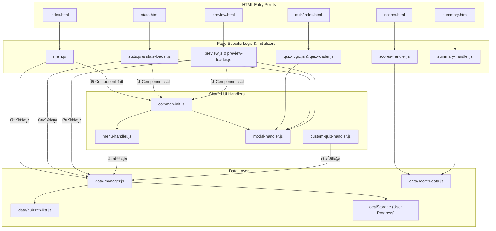

# Earth Science Quiz - แบบทดสอบเตรียมความพร้อม สอวน.

<div align="center">
  <!-- Badges for professionalism -->
  
  
</div>
<br>
<div align="center">
  
  <p><i>ภาพหน้าจอของแอปพลิเคชัน </i></p>
</div>

เว็บแอปพลิเคชันสำหรับฝึกทำแบบทดสอบออนไลน์ เพื่อช่วยนักเรียนเตรียมความพร้อมในการสอบคัดเลือกเข้าค่ายโอลิมปิกวิชาการ (สอวน.) ในสาขาวิชาดาราศาสตร์ และวิชาวิทยาศาสตร์โลกและอวกาศ มาพร้อมกับหน้าตาที่เรียบง่าย สะอาดตา โหมดการทำข้อสอบที่หลากหลาย ระบบติดตามสถิติอย่างละเอียด และเครื่องมือสำหรับผู้สอนในการติดตามและสรุปผลคะแนนของนักเรียน

<div align="center">

**[🚀 เข้าสู่เว็บไซต์ (Live Demo) 🚀](https://golftaweerak.github.io/Physics-and-EarthScience-Quiz/index.html)**

</div>

---

## ✨ คุณสมบัติเด่น (Features)

- **หมวดหมู่หลากหลาย:** ครอบคลุมเนื้อหาทั้งวิทยาศาสตร์โลก ดาราศาสตร์ และความรู้ทั่วไป
- **Responsive Design:** ใช้งานได้ดีบนทุกอุปกรณ์ ทั้งคอมพิวเตอร์ แท็บเล็ต และโทรศัพท์มือถือ
- **โหมดมืด (Dark Mode):** ถนอมสายตาเมื่อใช้งานในที่แสงน้อย
- **ตัวเลือกการจับเวลา:** เลือกทำข้อสอบได้ทั้งแบบไม่จับเวลา, จับเวลาทั้งชุด หรือจับเวลาเป็นรายข้อ
- **สร้างแบบทดสอบเอง (Custom Quiz):** สร้างชุดข้อสอบส่วนตัวโดยเลือกจำนวนข้อจากหมวดหมู่ต่างๆ ได้ตามต้องการ
- **บันทึกความคืบหน้า:** บันทึกการทำข้อสอบอัตโนมัติในเบราว์เซอร์ ทำให้สามารถกลับมาทำต่อได้
- **สถิติอย่างละเอียด:** ติดตามผลการทำข้อสอบด้วยสถิติภาพรวม และแยกตามหมวดหมู่หลักและหมวดหมู่ย่อย
- **โหมดทบทวนข้อผิด:** กลับไปดูข้อที่ตอบผิดพร้อมคำอธิบายและเฉลยอย่างละเอียด
- **ระบบตรวจสอบคะแนน (Score Lookup):** นักเรียนและผู้สอนสามารถค้นหาและดูผลคะแนนรายบุคคลได้อย่างละเอียด
- **แดชบอร์ดสรุปผล (Summary Dashboard):** หน้าสรุปผลสำหรับผู้สอน แสดงภาพรวมสถิติของนักเรียนทั้งหมด เช่น คะแนนเฉลี่ย, การกระจายเกรด, และประสิทธิภาพรายห้องเรียน
- **แสดงตัวอย่างและค้นหาข้อสอบ:** เครื่องมือสำหรับดู ค้นหา และตรวจสอบข้อสอบทั้งหมดในคลังข้อมูล
- **เครื่องมือสำหรับผู้พัฒนา:**
  - มีเครื่องมือช่วยสร้างชุดข้อสอบใหม่จากฟอร์ม หรือนำเข้าจากไฟล์ `.docx` ได้โดยตรง

## 🛠️ เทคโนโลยีที่ใช้

- HTML5
- CSS3 (Tailwind CSS)
- **Icons:** Heroicons
- JavaScript (ES6 Modules)
- KaTeX - สำหรับแสดงผลสูตรคณิตศาสตร์
- Mammoth.js - สำหรับแปลงไฟล์ .docx เป็น HTML

## 📂 โครงสร้างโปรเจกต์

```
/
├── 📂 assets/              # เก็บรูปภาพ, ไอคอน, และไฟล์เสียง
├── 📂 components/           # เก็บส่วนประกอบ HTML ที่ใช้ซ้ำ (Header, Footer)
├── 📂 data/                 # เก็บไฟล์ข้อมูลข้อสอบทั้งหมด (.js)
│   ├── quizzes-list.js    # ไฟล์หลักที่รวมรายการข้อสอบทั้งหมด
│   └── ... (ไฟล์ข้อมูลแต่ละชุด)
├── 📂 quiz/                 # หน้าสำหรับทำแบบทดสอบ (index.html)
├── 📂 scripts/              # เก็บไฟล์ JavaScript Modules ทั้งหมด
│   ├── app-loader.js      # โหลดส่วนประกอบหลักและเริ่มต้นการทำงานของหน้าหลัก
│   ├── common-init.js     # เริ่มต้นการทำงานของส่วนที่ใช้ร่วมกันในทุกหน้า
│   ├── component-loader.js # โหลดส่วนประกอบ HTML
│   ├── custom-quiz-handler.js # จัดการการสร้างและจัดการแบบทดสอบที่ผู้ใช้สร้างเอง
│   ├── dark-mode.js       # จัดการโหมดมืด
│   ├── data-manager.js    # จัดการข้อมูลหลักของแอปพลิเคชัน
│   ├── dev-tools-handler.js # จัดการการเข้าถึงเครื่องมือสำหรับนักพัฒนา
│   ├── dropdown.js        # จัดการ dropdown menu
│   ├── generator.js       # เครื่องมือสร้างข้อมูลข้อสอบ
│   ├── main.js            # สคริปต์หลักสำหรับหน้า index.html
│   ├── menu-handler.js    # จัดการเมนูหลัก
│   ├── modal-handler.js   # จัดการ modal dialog
│   ├── preview.js         # สคริปต์หลักสำหรับหน้าแสดงตัวอย่างข้อสอบ
│   ├── preview-loader.js  # โหลดสคริปต์สำหรับหน้าแสดงตัวอย่างข้อสอบ
│   ├── quiz-generator.js  # เครื่องมือสร้างข้อมูลข้อสอบ (อีกเวอร์ชัน)
│   ├── quiz-loader.js     # โหลดข้อมูลและเริ่มต้นแบบทดสอบ
│   ├── quiz-logic.js      # Logic หลักของระบบแบบทดสอบ
│   ├── quiz-page-loader.js # โหลดสคริปต์สำหรับหน้าทำแบบทดสอบ
│   ├── stats.js           # คำนวณและแสดงผลสถิติ
│   ├── stats-loader.js    # โหลดสคริปต์สำหรับหน้าสถิติ
│   ├── txt-exporter.js    # ส่งออกข้อมูลเป็นไฟล์ .txt
│   └── utils.js           # ฟังก์ชันช่วยเหลือทั่วไป
├── 📂 styles/               # เก็บไฟล์ CSS
│   ├── animations.css     # แอนิเมชันทั่วไป
│   ├── bundle.css         # ไฟล์ CSS หลักที่รวมทุกอย่าง
│   ├── quiz-animations.css # แอนิเมชันสำหรับหน้าแบบทดสอบ
│   └── quiz.css           # สไตล์สำหรับหน้าแบบทดสอบ
├── index.html             # หน้าหลัก
├── stats.html             # หน้าสถิติ
└── preview.html           # หน้าแสดงตัวอย่างและค้นหาข้อสอบ
```

---

## 📚 ภาพรวมโมดูล JavaScript ฝั่ง Client (Client-side JavaScript Modules)

โฟลเดอร์ `scripts/` ประกอบด้วยโมดูล JavaScript ที่ทำงานฝั่ง Client ซึ่งแต่ละไฟล์มีหน้าที่เฉพาะเจาะจงในการขับเคลื่อนฟังก์ชันการทำงานของเว็บไซต์:

*   **`app-loader.js`**: โหลดส่วนประกอบหลักของหน้าเว็บ (header, footer, modals) และเริ่มต้นการทำงานของสคริปต์ที่จำเป็นสำหรับหน้าหลัก เช่น การจัดการเมนูแบบ accordion, การสร้างแบบทดสอบเอง และการแก้ไขการเลื่อนหน้าเมื่อคลิก anchor link
*   **`common-init.js`**: เริ่มต้นการทำงานของสคริปต์ที่ใช้ร่วมกันในหลายๆ หน้า เช่น dark mode, dropdown menu และเมนูหลัก
*   **`component-loader.js`**: โหลดไฟล์ HTML ที่เป็นส่วนประกอบ (component) เข้าไปใน element ที่กำหนดในหน้าเว็บ
*   **`custom-quiz-handler.js`**: จัดการทุกอย่างที่เกี่ยวกับการสร้างและจัดการแบบทดสอบที่ผู้ใช้สร้างเอง (custom quiz) ตั้งแต่การแสดง modal, การเลือกคำถาม, การบันทึก และการแสดงรายการแบบทดสอบที่สร้างไว้
*   **`dark-mode.js`**: จัดการการเปิด/ปิด dark mode และบันทึกค่าที่เลือกลงใน `localStorage`
*   **`data-manager.js`**: เป็นศูนย์กลางจัดการข้อมูลของแอปพลิเคชัน ทั้งข้อมูลรายละเอียดหมวดหมู่, การดึงข้อมูลความคืบหน้าของแบบทดสอบจาก `localStorage` และการโหลดข้อมูลคำถามทั้งหมดจากไฟล์ต่างๆ
*   **`dev-tools-handler.js`**: จัดการการเข้าถึงเครื่องมือสำหรับนักพัฒนา โดยจะแสดง modal ให้ใส่รหัสผ่านก่อนเข้าสู่หน้าเครื่องมือ
*   **`dropdown.js`**: จัดการการทำงานของ dropdown menu ทั่วไป ทำให้สามารถเปิด/ปิดได้ และจัดการเรื่องการเข้าถึง (accessibility)
*   **`generator.js`**: จัดการหน้า "Quiz Generator" ซึ่งเป็นเครื่องมือสำหรับสร้างไฟล์ข้อมูลแบบทดสอบ (`-data.js`) และข้อมูลสำหรับ `quizzes-list.js` มีฟังก์ชันสำหรับเพิ่ม/ลบ/แก้ไขคำถาม, import จากไฟล์ DOCX, และสร้างโค้ดสุดท้าย
*   **`main.js`**: สคริปต์หลักสำหรับหน้า `index.html` จัดการการแสดงผลหมวดหมู่แบบทดสอบในรูปแบบ accordion, การ์ดแบบทดสอบ และความคืบหน้าของผู้ใช้ รวมถึงแถบนำทางแบบลอย (floating navigation bar)
*   **`menu-handler.js`**: จัดการเมนูหลัก (main menu) ที่แสดงรายการแบบทดสอบทั้งหมด (ทั้งแบบปกติและแบบที่ผู้ใช้สร้างเอง) พร้อมทั้งแสดงความคืบหน้าและจัดการการคลิกเพื่อเริ่มทำแบบทดสอบ
*   **`modal-handler.js`**: เป็น class สำหรับจัดการ modal dialog ทั่วไป ทำให้สามารถเปิด/ปิด, จัดการ focus และปิดเมื่อคลิกนอก modal หรือกดปุ่ม Escape ได้อย่างง่ายดายและสอดคล้องกับมาตรฐานการเข้าถึง (accessibility)
*   **`quiz-generator.js`**: (ไฟล์นี้มีฟังก์ชันการทำงานคล้ายกับ `generator.js`) เป็นอีกเวอร์ชันหนึ่งของหน้าสร้างแบบทดสอบ มีฟังก์ชันการเพิ่ม/แก้ไข/ลบคำถาม และสร้างโค้ดสำหรับไฟล์ข้อมูล
*   **`quiz-loader.js`**: เป็น loader สำหรับหน้าทำแบบทดสอบ (`quiz/index.html`) ทำหน้าที่โหลดข้อมูลคำถามจากไฟล์ที่ระบุใน URL และส่งต่อไปให้ `quiz-logic.js` เพื่อเริ่มทำแบบทดสอบ
*   **`quiz-logic.js`**: เป็นหัวใจหลักของหน้าทำแบบทดสอบ จัดการสถานะของแบบทดสอบ (ข้อปัจจุบัน, คะแนน, เวลา), การแสดงคำถามและตัวเลือก, การตรวจคำตอบ, การแสดงผลลัพธ์ และการบันทึกความคืบหน้า
*   **`quiz-page-loader.js`**: เป็น loader หลักสำหรับหน้าทำแบบทดสอบ (`quiz/index.html`) โหลดส่วนประกอบร่วมและเริ่มต้นการทำงานของ `quiz-loader.js`
*   **`stats.js`**: จัดการการคำนวณและแสดงผลสถิติในหน้า `stats.html` ดึงข้อมูลจาก `localStorage` มาคำนวณสถิติสรุป, คะแนนเฉลี่ยตามหมวดหมู่ และแสดงรายการแบบทดสอบที่เคยทำ
*   **`stats-loader.js`**: เป็น loader สำหรับหน้า `stats.html` โหลดส่วนประกอบที่จำเป็นและเริ่มต้นการทำงานของ `stats.js` เพื่อสร้างหน้าสถิติ
*   **`txt-exporter.js`**: มีฟังก์ชันสำหรับส่งออก (export) ข้อมูลแบบทดสอบเป็นไฟล์ `.txt`
*   **`utils.js`**: เก็บฟังก์ชันช่วยเหลือที่ใช้ร่วมกันในหลายๆ ไฟล์ เช่น `shuffleArray` สำหรับสลับลำดับของ array

---

## 🏗️ ภาพรวมสถาปัตยกรรม (Architecture Overview)

ไดอะแกรมด้านล่างแสดงความสัมพันธ์และการไหลของข้อมูลระหว่างโมดูล JavaScript หลักในโปรเจกต์



**คำอธิบายไดอะแกรม:**

- **HTML Entry Points:** คือไฟล์ `.html` หลักที่ผู้ใช้เข้าถึง
- **Page-Specific Logic & Initializers:** คือไฟล์ JavaScript ที่ทำงานเป็นหลักในแต่ละหน้า มีหน้าที่ควบคุมการแสดงผลและตรรกะทั้งหมดของหน้านั้นๆ
- **Shared UI Handlers:** คือโมดูลที่จัดการส่วนประกอบ UI ที่ใช้ร่วมกันในหลายๆ หน้า เช่น เมนู, Modal, และ Dark Mode
- **Data Layer:** คือส่วนที่จัดการการเข้าถึงข้อมูลทั้งหมด ไม่ว่าจะเป็นข้อมูลข้อสอบจากไฟล์ `.js` หรือข้อมูลความคืบหน้าของผู้ใช้จาก `localStorage`

## 💻 การติดตั้งและใช้งานในเครื่อง (Local Development)

1. Clone a copy of the repository:
   ```bash
   git clone https://github.com/golftaweerak/EarthScienceQuiz.git
   ```
2. เปิดโฟลเดอร์โปรเจกต์ในโปรแกรมแก้ไขโค้ด เช่น VS Code
3. เนื่องจากโปรเจกต์ใช้ `fetch` API ในการโหลดไฟล์ (modules, data) การเปิดไฟล์ `index.html` โดยตรงอาจพบปัญหา CORS. แนะนำให้ใช้ local server:
   - **ใช้ VS Code Live Server Extension:** คลิกขวาที่ไฟล์ `index.html` แล้วเลือก "Open with Live Server"
   - **ใช้ Python:** เปิด Terminal ในโฟลเดอร์โปรเจกต์แล้วรันคำสั่ง:
     ```bash
     # สำหรับ Python 3
     python -m http.server
     ```

     จากนั้นเปิดเบราว์เซอร์ไปที่ `http://localhost:8000`

## 📝 การเพิ่มชุดข้อสอบใหม่

วิธีที่ง่ายที่สุดในการเพิ่มชุดข้อสอบใหม่คือการใช้เครื่องมือสร้างข้อมูล (Generator-beta) ที่มีในเว็บ

1. **เข้าสู่เครื่องมือผู้พัฒนา:**

   - ไปที่หน้า "เกี่ยวกับผู้จัดทำ" (About)
   - คลิกปุ่ม "เครื่องมือผู้พัฒนา" และใส่รหัสผ่าน
   - ระบบจะนำทางไปยังหน้า `preview-data.html`
2. **ใช้เครื่องมือสร้างข้อมูล (Generator):**

   - เลือกแท็บ "เครื่องมือสร้างข้อมูล (Generator)"
   - **ขั้นตอนที่ 1:** กรอกข้อมูลทั่วไปของชุดข้อสอบ (ID, Title, Category, etc.)
   - **ขั้นตอนที่ 2:** เพิ่มคำถาม โดยสามารถ:
     - คลิก "เพิ่มคำถามเดี่ยว" หรือ "เพิ่มสถานการณ์" เพื่อกรอกข้อมูลผ่านฟอร์ม
     - คลิก "นำเข้าจาก .docx" เพื่อนำเข้าข้อสอบจากไฟล์ `.docx` ที่มีโครงสร้างตามตัวอย่าง
3. **คัดลอกโค้ดที่สร้างขึ้น:**

   - **ขั้นตอนที่ 3:** เครื่องมือจะสร้างโค้ด 2 ส่วน
   - คัดลอกโค้ดส่วนแรก (สำหรับ `quizzes-list.js`)
4. **อัปเดตไฟล์ในโปรเจกต์:**

   - เปิดไฟล์ `data/quizzes-list.js` แล้วนำโค้ดที่คัดลอกมาไปวางต่อท้ายใน array `quizList`
   - กลับไปที่หน้า Generator แล้วคัดลอกโค้ดส่วนที่สอง (ข้อมูลข้อสอบ)
   - สร้างไฟล์ใหม่ในโฟลเดอร์ `/data` ตามชื่อที่ระบุในหน้า Generator (เช่น `data/NewQuiz-data.js`)
   - นำโค้ดข้อมูลข้อสอบไปวางในไฟล์ใหม่นี้แล้วบันทึก
5. **เสร็จสิ้น!**

   - รีเฟรชหน้าเว็บไซต์ ชุดข้อสอบใหม่จะปรากฏขึ้นโดยอัตโนมัติ

---

### 🧑‍💻 สำหรับผู้พัฒนา (For Developers)

โปรเจคนี้มีเครื่องมือและสคริปต์ที่ช่วยให้การจัดการชุดข้อสอบเป็นไปโดยอัตโนมัติและลดความผิดพลาด ซึ่งสามารถรันผ่าน NPM ได้

#### การตั้งค่าสภาพแวดล้อม (Environment Setup)

ก่อนรันสคริปต์ครั้งแรก คุณต้องติดตั้ง dependencies ที่จำเป็นก่อน โดยรันคำสั่ง:

```bash
npm install
```

#### ⚡️ NPM Scripts สำหรับการจัดการโปรเจค

หลังจากตั้งค่าแล้ว คุณสามารถใช้คำสั่งต่อไปนี้จาก Terminal ใน root directory ของโปรเจคได้:

-   **`npm run update:list`**
    -   สแกนไฟล์ข้อมูล (`*-data.js`) ในโฟลเดอร์ `/data` ทั้งหมด
    -   เพิ่มชุดข้อสอบใหม่และอัปเดตจำนวนข้อ (amount) ในไฟล์ `data/quizzes-list.js` โดยอัตโนมัติ

-   **`npm run validate:duplicates`**
    -   ตรวจสอบหาคำถามที่ซ้ำซ้อนกันภายในไฟล์ข้อมูลทั้งหมด

-   **`npm run validate:subcategories`**
    -   ตรวจสอบความถูกต้องของ `subCategory` ในไฟล์ข้อมูลทั้งหมดเทียบกับ `data/sub-category-data.js`

-   **`npm run summarize`**
    -   สร้างรายงานสรุปจำนวนข้อในแต่ละหมวดหมู่

-   **`npm run validate`**
    -   รันสคริปต์ `validate:duplicates` และ `validate:subcategories` ต่อเนื่องกัน

-   **`npm run manage`**
    -   **(แนะนำ)** คำสั่งหลักสำหรับ Workflow ทั่วไป
    -   รัน `update:list` เพื่ออัปเดตรายการข้อสอบ จากนั้นรัน `validate` เพื่อตรวจสอบความถูกต้องทั้งหมดในขั้นตอนเดียว

**Workflow ที่แนะนำ:**
เมื่อคุณเพิ่มหรือแก้ไขไฟล์ข้อมูลข้อสอบในโฟลเดอร์ `/data` ให้รันคำสั่ง:
```bash
npm install
```

---

### 🧑‍💻 ผู้จัดทำ

- **นายทวีรักษ์ ทูลพุทธา**
- โรงเรียนพรหมานุสรณ์จังหวัดเพชรบุรี

---

## 🤝 การมีส่วนร่วม (Contributing)

เรายินดีต้อนรับทุกการมีส่วนร่วม! ไม่ว่าจะเป็นการรายงานข้อผิดพลาด (Bug), การเสนอคุณสมบัติใหม่, หรือการปรับปรุงแก้ไขโค้ด
- **รายงานข้อผิดพลาด/เสนอแนะ:** กรุณาเปิด [Issue](https://github.com/golftaweerak/EarthScienceQuiz/issues)
- **ส่ง Pull Request:** หากคุณต้องการแก้ไขโค้ด กรุณา Fork โปรเจกต์และสร้าง Pull Request

## 📄 สัญญาอนุญาต (License)

โปรเจกต์นี้อยู่ภายใต้สัญญาอนุญาตแบบ MIT ดูรายละเอียดเพิ่มเติมได้ที่ไฟล์ [LICENSE](LICENSE)
(แนะนำให้สร้างไฟล์ `LICENSE` ที่ root ของโปรเจกต์)